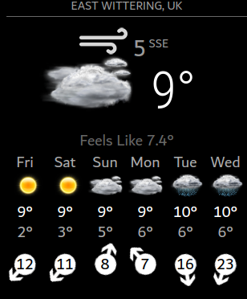

# Module: MMM-OneCallWeather
This is another weather module for MagicMirror. It is based somewhat around https://github.com/jharttech/MMM-weatherforecast and the default 'weather' app. This version has been edited to allow the days of the week to span left to right, each with its own weather icon and details.

The app uses data from the currently-free source of openweathermap.org, using their one-call API - https://openweathermap.org/api/one-call-api. 

## Screenshot
<br>*Typical view of weather*

## Installation
In your terminal, go to your MagicMirror's Module folder:

```
cd ~/MagicMirror/modules
```
Clone this repository:
```
git clone https://github.com/Captsi/MMM-OneCallWeather.git
```
Go to https://openweathermap.org/api and subscribe to One Call API. Its free to set up an account, and the free subscription level is fine for this app. The API returns a lot of information and can return 1000 calls a day on the free subscription level (approx once every 2 minutes maximum). The API is good as it uses their algorithms to give ultra local weather reports, even if you don't live in a named location, which some other apps suffer with.

Go to https://www.latlong.net/ and figure out where you want the forecast for. There are plenty of ways of figuring out your location, and you just need a decimal format of your position. 52N 010W becomes 52.0 -10.0 on the two lines in your config.

## Notes
Icons used in this module were created by:

VClouds Weather Icons
Created and copyrighted by VClouds - http://vclouds.deviantart.com/

The icons are free to use for Non-Commercial use and can be found at icons DA page - http://vclouds.deviantart.com/gallery/#/d2ynulp

Note:  You can use any of your own icons but you will have to rename them to the weather items shown on openweather. There are only 9 types of weather that the API currently shows (2021) and they are shown on https://openweathermap.org/weather-conditions. With some different icons for day and night you should have 18 icons in each folder, some of which will just be copies.

This module displays the weather forecast for the coming week, including an an icon to display the current conditions, the minimum temperature and the maximum temperature. The software is designed around a display in Celsius and miles per hour, but should work in a multitude of units. I found that the openweathermap information is a bit crude in that you cant have Farenheight and metres per second, or celsius and miles per hour, hence this code. Its a bit clunky. 

## Using the module
To use this module, add it to the modules array in the `config/config.js` file:
````javascript
modules: [
	{
		module: "MMM-OneCallWeather",
		position: "top_right",	// This can be any of the regions.
					// Best results in bottom_bar region due to horizontal default layout and icon sizes.
		config: {
			// See 'Configuration options' for more information.
			latitude: "51.500149", //Longitude from https://www.latlong.net/
			longitude: "-0.126240", //Longitude from https://www.latlong.net/ - is West + is East of London
			apikey: "abcde12345abcde12345abcde12345ab" //openweathermap.org API key.
		}
	}
]
````

## Configuration options

The following properties can be configured:

| Option                       | Description
| ---------------------------- | -----------
| `latitude`                   | The latitude of the location used for weather information. <br><br> **Example:** `'51.500149'` <br> **Default value:** `false` <br><br> **Note:** When the Value is **REQUIRED**
| `longitude`                 | The longitude of the location used for weather information. <br> <br> **Example:** `-0.126240` <br><br> **Note:** - (minus sign) is West + (plus, or no minus sign) is East of the prime meridian in London. To find your location you can go to latlong.net, or use google maps. If no value is entered  for either lat or long the module will not work. Value is **REQUIRED**
| `apikey`                      | The [OpenWeatherMap](https://home.openweathermap.org) API key, which can be obtained by creating an OpenWeatherMap account. <br><br> This value is **REQUIRED**
| `units`                      | What units to use. Specified by config.js <br><br> **Possible values:** `config.units` = Specified by config.js, `default` = Kelvin, `metric` = Celsius, `imperial` =Fahrenheit <br> **Default value:** `config.units`
| `roundTemp`                  | Round temperature values to nearest integer. <br><br> **Possible values:** `true` (round to integer) or `false` (display exact value with decimal point) <br> **Default value:** `false`
| `maxNumberOfDays`            | How many days of forecast to return. Specified by config.js <br><br> **Possible values:** `1` - `16` <br> **Default value:** `7` (7 days) <br> This value is optional. By default the weatherforecast module will return 7 days.
| `layout`            | Define whether layout should be horizontal or vertical. Specified by config.js <br><br> **Possible values:** `"horizontal"` , `"vertical"` or `"default"` <br> **Default value:** `"default"` <br> This value is optional. By default the weatherforecast module display in a hybrid format. The vertical option is OK too. Some work still needs to be done on pretty formats.
| `showRainAmount`             | Should the predicted rain amount be displayed? <br><br> **Possible values:** `true` or `false` <br> **Default value:** `false` <br> This value is optional. By default the weatherforecast module will not display the predicted amount of rain.
| `updateInterval`             | How often does the content needs to be fetched? (Milliseconds) <br><br> **Possible values:** `1000` - `86400000` <br> **Default value:** `600000` (10 minutes). The free subscription level currently allows a call every 2 minutes.
| `animationSpeed`             | Speed of the update animation. (Milliseconds) <br><br> **Possible values:** `0` - `5000` <br> **Default value:** `1000` (1 second)
| `lang`                       | The language of the days. <br><br> **Possible values:** `en`, `nl`, `ru`, etc ... <br> **Default value:** uses value of _config.language_
| `iconset`                    | The icon set to use.<br><br> **Possible values:** `4a`, `3c` or any other folder of icons in the MMM-OneCallWeather/icons folder.<br> **Default value:4a** `.`
| `iconsetFormat`              | The format of the symbols in the above iconset folders. The module can't parse the filetype of the icons so you have to tell it what type it is. Magic Mirror is pretty flexible with image types. If you have some funky icons try them out<br><br> **Possible values:** `png`, `svg` or any other image file type.<br> **Default value:png** `.`
| `decimalSymbol`              | The decimal symbol to use.<br><br> **Possible values:** `.`, `,` or any other symbol.<br> **Default value:** `.`
| `fade`                       | Fade the future events to black. (Gradient) <br><br> **Possible values:** `true` or `false` <br> **Default value:** `true`
| `fadePoint`                  | Where to start fade? <br><br> **Possible values:** `0` (top of the list) - `1` (bottom of list) <br> **Default value:** `0.25`
| `initialLoadDelay`           | The initial delay before loading. If you have multiple modules that use the same API key, you might want to delay one of the requests. (Milliseconds) <br><br> **Possible values:** `1000` - `5000` <br> **Default value:**  `2500` (2.5 seconds delay. This delay is used to keep the OpenWeather API happy.)
| `retryDelay`                 | The delay before retrying after a request failure. (Milliseconds) <br><br> **Possible values:** `1000` - `60000` <br> **Default value:**  `2500`
| `apiVersion`                 | The OpenWeatherMap API version to use. <br><br> **Default value:**  `2.5`
| `apiBase`                    | The OpenWeatherMap base URL. <br><br> **Default value:**  `'http://api.openweathermap.org/data/'`
| `forecastEndpoint`           | The OpenWeatherMap API endPoint. <br><br> **Default value:**  `'forecast/daily'`
| `appendLocationNameToHeader` | If set to `true`, the returned location name will be appended to the header of the module, if the header is enabled. This is mainly intresting when using calender based weather. <br><br> **Default value:**  `true`
| `calendarClass`              | The class for the calender module to base the event based weather information on. <br><br> **Default value:** `'calendar'`
| `tableClass`                  | Name of the classes issued from `main.css`. <br><br> **Possible values:** xsmall, small, medium, large, xlarge. <br> **Default value:** _small._
  `colored`                    | If set 'colored' to true the min-temp get a blue tone and the max-temp get a red tone. <br><br> **Default value:** `'false'`

iconset
